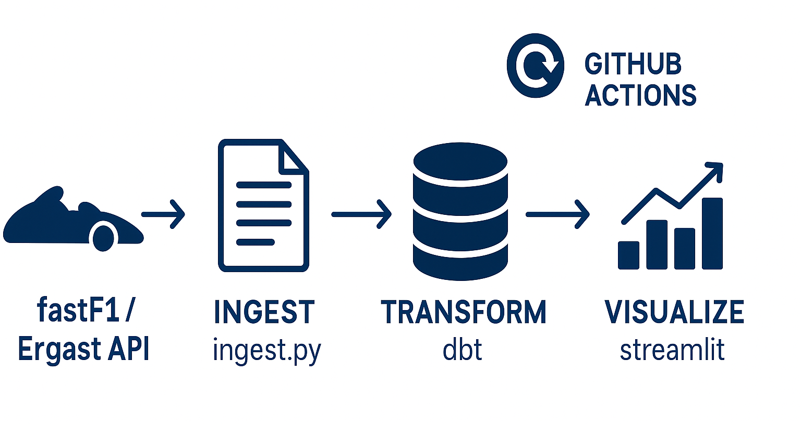

# 🏎️ Formula 1 Data Pipeline

An **end-to-end automated Formula 1 data pipeline** that ingests, transforms, and visualizes race and driver data from the Ergast and FastF1 APIs — built for speed, reliability, and automation.

---

## 📘 Project Overview

This project demonstrates a **modern data engineering workflow** for Formula 1 analytics.  
It automatically collects and transforms data on a weekly schedule, updating an interactive dashboard with the latest race and driver information.

### Key Features
- **Automated Data Ingestion** – Pulls F1 data from the [Ergast API](https://ergast.com/mrd/) and FastF1 library.
- **Data Transformation with dbt** – Cleans and models raw data into analytics-ready tables.
- **SQLite Database Storage** – Local, lightweight database (`db/f1.db`) for quick access.
- **Automated Updates via GitHub Actions** – Weekly pipeline runs keep your data fresh.
- **Interactive Streamlit Dashboard** – Explore results, standings, and insights in real time.

---

## 🔧 Pipeline Architecture

The pipeline consists of three main layers:

| Layer | Tool | Description |
|-------|------|-------------|
| **Ingest** | FastF1 + Ergast API | Fetch raw driver, constructor, race, and sprint data |
| **Transform** | dbt | Clean, join, and model ingested data |
| **Visualize** | Streamlit | Interactive dashboard and project overview |

<p align="center">
  
</p>

---

## 🧩 Tech Stack

| Category | Tool |
|-----------|------|
| **Data Source** | FastF1 / Ergast API |
| **Database** | SQLite |
| **Transformation** | dbt |
| **Automation** | GitHub Actions |
| **Visualization** | Streamlit |
| **Testing** | dbt tests + act (local GitHub Actions runner through Docker) |

---

## ⚙️ Automation

This project is fully automated via **GitHub Actions**, which:
1. Runs the ingestion script (`src/ingest.py`)
2. Executes dbt models and tests
3. Commits the updated `f1.db` file back to the repository

You can trigger it manually or let it run weekly via the included `update_data.yml` workflow.

---

## 🔧 Local Setup
1. Use the following commands to be able to set up the dashboard locally:
   ```bash
   python -m venv .venv
   .venv\Scripts\activate
   pip install -r requirements.txt
   python .\src\ingest.py
   cd .\f1_dbt_project\ 
   dbt build
   cd ..
   streamlit run dashboard/app.py

---

## 🧩 Next Steps

- **Streamline Ingestion Process:** Incremental ingests
- **Increased Accessibility:** introduce Docker in the repository to allow users to build dashboard loaclly
- **Historical Data:** Add visualisations on data from before the 2025 season